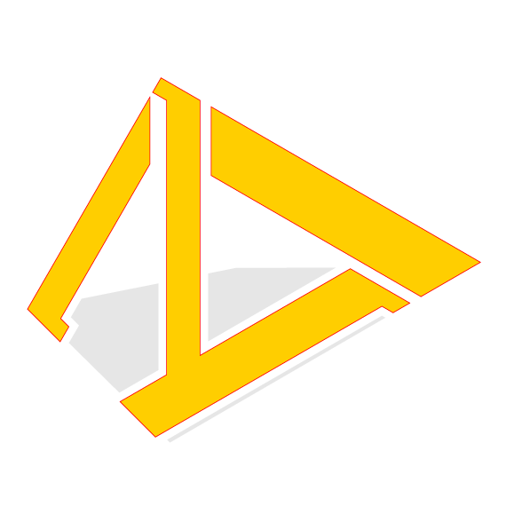

---
# Feel free to add content and custom Front Matter to this file.
# To modify the layout, see https://jekyllrb.com/docs/themes/#overriding-theme-defaults

layout: home
revitapi: https://www.revitapidocs.com/
---
{:height="68px"}  

_**tailoryourbim.com**_ is a place where you can find information for your BIM issues. We focus on finding solutions for modelling in _[Rhino](http://rhino3d.com){:target="_blank"}_ and _[Autodesk Revit](https://www.autodesk.com/products/revit/overview){:target="_blank"}_ with diversive methods, including writing programs built on their APIs, [RhinoCommon](https://developer.rhino3d.com/api/RhinoCommon/html/R_Project_RhinoCommon.htm){:target="_blank"} and [RevitAPI](https://www.revitapidocs.com/){:target="_blank"}, with languages, such as [Python](https://www.python.org/){:target="_blank"} and [FSharp](https://fsharp.org/){:target="_blank"}. Have a look at the posts below. If you cannot find the right information for your issues there, contact us directly at [info@tailoryourbim.com](mailto:info@tailoryourbim.com).  

<signup-component></signup-component>

Dig in and have fun!